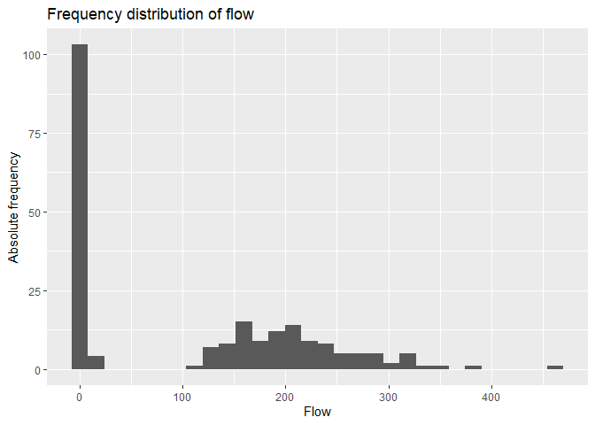
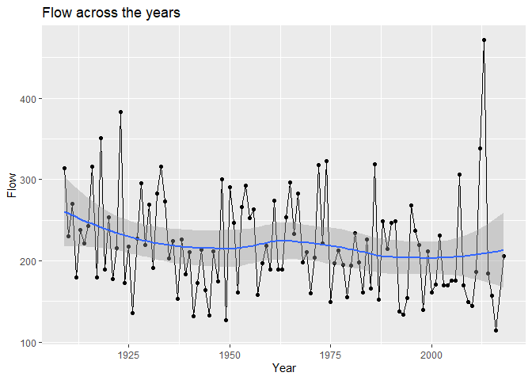
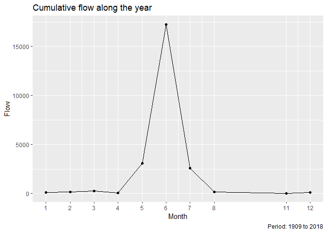
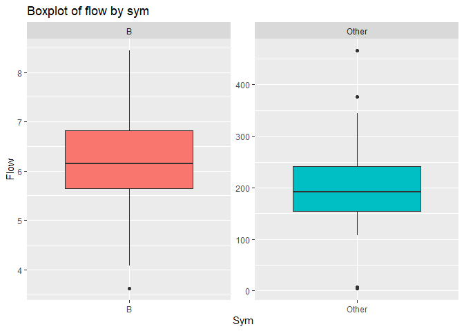
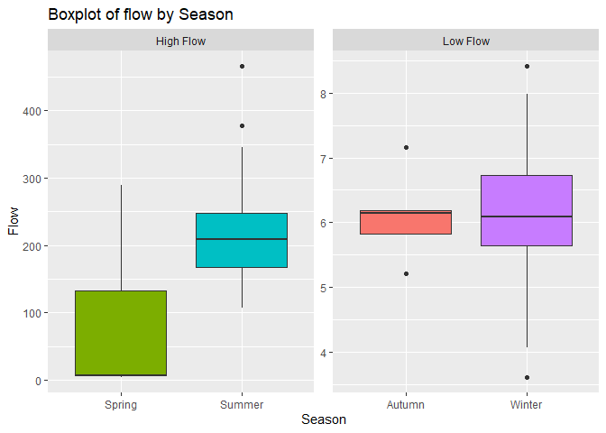

Mini Data Analysis
================

# Task 1

## Choose 4 data sets

After an initial pass I have selected the following data sets to explore
in more detail:

1: `flow_sample` 2: `vancouver_trees` 3: `cancer_sample` 4:
`steam_games`

## Bellow I explore these 3 attributes of the data sets from the datateacher package.

First I load needed packages.

``` r
#install.packages("devtools")
#devtools::install_github("UBC-MDS/datateachr")
```

``` r
#install.packages("datateachr")
library(datateachr)
library(tidyverse)
```

    ## Warning: package 'tidyverse' was built under R version 4.0.5

    ## -- Attaching packages --------------------------------------- tidyverse 1.3.1 --

    ## v ggplot2 3.3.5     v purrr   0.3.4
    ## v tibble  3.1.4     v dplyr   1.0.7
    ## v tidyr   1.1.3     v stringr 1.4.0
    ## v readr   2.0.1     v forcats 0.5.1

    ## Warning: package 'ggplot2' was built under R version 4.0.5

    ## Warning: package 'tibble' was built under R version 4.0.5

    ## Warning: package 'tidyr' was built under R version 4.0.5

    ## Warning: package 'readr' was built under R version 4.0.5

    ## Warning: package 'purrr' was built under R version 4.0.5

    ## Warning: package 'dplyr' was built under R version 4.0.5

    ## Warning: package 'stringr' was built under R version 4.0.5

    ## Warning: package 'forcats' was built under R version 4.0.5

    ## -- Conflicts ------------------------------------------ tidyverse_conflicts() --
    ## x dplyr::filter() masks stats::filter()
    ## x dplyr::lag()    masks stats::lag()

### Now I look at some attributes of the data set `flow_sample`.

``` r
glimpse(flow_sample)
```

    ## Rows: 218
    ## Columns: 7
    ## $ station_id   <chr> "05BB001", "05BB001", "05BB001", "05BB001", "05BB001", "0~
    ## $ year         <dbl> 1909, 1910, 1911, 1912, 1913, 1914, 1915, 1916, 1917, 191~
    ## $ extreme_type <chr> "maximum", "maximum", "maximum", "maximum", "maximum", "m~
    ## $ month        <dbl> 7, 6, 6, 8, 6, 6, 6, 6, 6, 6, 6, 7, 6, 6, 6, 7, 5, 7, 6, ~
    ## $ day          <dbl> 7, 12, 14, 25, 11, 18, 27, 20, 17, 15, 22, 3, 9, 5, 14, 5~
    ## $ flow         <dbl> 314, 230, 264, 174, 232, 214, 236, 309, 174, 345, 185, 24~
    ## $ sym          <chr> NA, NA, NA, NA, NA, NA, NA, NA, NA, NA, NA, NA, NA, NA, N~

Three attributes of `flow_sample`:

1)  It has 7 columns and 218 rows. Please note I later removed the
    column `station_id` as there was only the one value. Unfortunately,
    this had the unintended consequence of removing the variable up here
    where I glimpse the data as well.

2)  Has both quantitative and qualitative variables.

3)  There appears to be quite a few missing values in this data set.

### Next we look at the data set `vancouver_trees`.

``` r
glimpse(vancouver_trees)
```

    ## Rows: 146,611
    ## Columns: 20
    ## $ tree_id            <dbl> 149556, 149563, 149579, 149590, 149604, 149616, 149~
    ## $ civic_number       <dbl> 494, 450, 4994, 858, 5032, 585, 4909, 4925, 4969, 7~
    ## $ std_street         <chr> "W 58TH AV", "W 58TH AV", "WINDSOR ST", "E 39TH AV"~
    ## $ genus_name         <chr> "ULMUS", "ZELKOVA", "STYRAX", "FRAXINUS", "ACER", "~
    ## $ species_name       <chr> "AMERICANA", "SERRATA", "JAPONICA", "AMERICANA", "C~
    ## $ cultivar_name      <chr> "BRANDON", NA, NA, "AUTUMN APPLAUSE", NA, "CHANTICL~
    ## $ common_name        <chr> "BRANDON ELM", "JAPANESE ZELKOVA", "JAPANESE SNOWBE~
    ## $ assigned           <chr> "N", "N", "N", "Y", "N", "N", "N", "N", "N", "N", "~
    ## $ root_barrier       <chr> "N", "N", "N", "N", "N", "N", "N", "N", "N", "N", "~
    ## $ plant_area         <chr> "N", "N", "4", "4", "4", "B", "6", "6", "3", "3", "~
    ## $ on_street_block    <dbl> 400, 400, 4900, 800, 5000, 500, 4900, 4900, 4900, 7~
    ## $ on_street          <chr> "W 58TH AV", "W 58TH AV", "WINDSOR ST", "E 39TH AV"~
    ## $ neighbourhood_name <chr> "MARPOLE", "MARPOLE", "KENSINGTON-CEDAR COTTAGE", "~
    ## $ street_side_name   <chr> "EVEN", "EVEN", "EVEN", "EVEN", "EVEN", "ODD", "ODD~
    ## $ height_range_id    <dbl> 2, 4, 3, 4, 2, 2, 3, 3, 2, 2, 2, 5, 3, 2, 2, 2, 2, ~
    ## $ diameter           <dbl> 10.00, 10.00, 4.00, 18.00, 9.00, 5.00, 15.00, 14.00~
    ## $ curb               <chr> "N", "N", "Y", "Y", "Y", "Y", "Y", "Y", "Y", "Y", "~
    ## $ date_planted       <date> 1999-01-13, 1996-05-31, 1993-11-22, 1996-04-29, 19~
    ## $ longitude          <dbl> -123.1161, -123.1147, -123.0846, -123.0870, -123.08~
    ## $ latitude           <dbl> 49.21776, 49.21776, 49.23938, 49.23469, 49.23894, 4~

Three attributes of `vancouver_trees`:

1)  It has 20 columns and 146,611 rows.

2)  Has quantitative (<dbl>) and qualitative (<chr>) variables. As well
    as a date variable( <date>).

3)  The qualitative variables appear to mostly be categorical. eg:
    `genus_name`.

\#\#\#Next we look at the data set `cancer_sample`

``` r
glimpse(cancer_sample)
```

    ## Rows: 569
    ## Columns: 32
    ## $ ID                      <dbl> 842302, 842517, 84300903, 84348301, 84358402, ~
    ## $ diagnosis               <chr> "M", "M", "M", "M", "M", "M", "M", "M", "M", "~
    ## $ radius_mean             <dbl> 17.990, 20.570, 19.690, 11.420, 20.290, 12.450~
    ## $ texture_mean            <dbl> 10.38, 17.77, 21.25, 20.38, 14.34, 15.70, 19.9~
    ## $ perimeter_mean          <dbl> 122.80, 132.90, 130.00, 77.58, 135.10, 82.57, ~
    ## $ area_mean               <dbl> 1001.0, 1326.0, 1203.0, 386.1, 1297.0, 477.1, ~
    ## $ smoothness_mean         <dbl> 0.11840, 0.08474, 0.10960, 0.14250, 0.10030, 0~
    ## $ compactness_mean        <dbl> 0.27760, 0.07864, 0.15990, 0.28390, 0.13280, 0~
    ## $ concavity_mean          <dbl> 0.30010, 0.08690, 0.19740, 0.24140, 0.19800, 0~
    ## $ concave_points_mean     <dbl> 0.14710, 0.07017, 0.12790, 0.10520, 0.10430, 0~
    ## $ symmetry_mean           <dbl> 0.2419, 0.1812, 0.2069, 0.2597, 0.1809, 0.2087~
    ## $ fractal_dimension_mean  <dbl> 0.07871, 0.05667, 0.05999, 0.09744, 0.05883, 0~
    ## $ radius_se               <dbl> 1.0950, 0.5435, 0.7456, 0.4956, 0.7572, 0.3345~
    ## $ texture_se              <dbl> 0.9053, 0.7339, 0.7869, 1.1560, 0.7813, 0.8902~
    ## $ perimeter_se            <dbl> 8.589, 3.398, 4.585, 3.445, 5.438, 2.217, 3.18~
    ## $ area_se                 <dbl> 153.40, 74.08, 94.03, 27.23, 94.44, 27.19, 53.~
    ## $ smoothness_se           <dbl> 0.006399, 0.005225, 0.006150, 0.009110, 0.0114~
    ## $ compactness_se          <dbl> 0.049040, 0.013080, 0.040060, 0.074580, 0.0246~
    ## $ concavity_se            <dbl> 0.05373, 0.01860, 0.03832, 0.05661, 0.05688, 0~
    ## $ concave_points_se       <dbl> 0.015870, 0.013400, 0.020580, 0.018670, 0.0188~
    ## $ symmetry_se             <dbl> 0.03003, 0.01389, 0.02250, 0.05963, 0.01756, 0~
    ## $ fractal_dimension_se    <dbl> 0.006193, 0.003532, 0.004571, 0.009208, 0.0051~
    ## $ radius_worst            <dbl> 25.38, 24.99, 23.57, 14.91, 22.54, 15.47, 22.8~
    ## $ texture_worst           <dbl> 17.33, 23.41, 25.53, 26.50, 16.67, 23.75, 27.6~
    ## $ perimeter_worst         <dbl> 184.60, 158.80, 152.50, 98.87, 152.20, 103.40,~
    ## $ area_worst              <dbl> 2019.0, 1956.0, 1709.0, 567.7, 1575.0, 741.6, ~
    ## $ smoothness_worst        <dbl> 0.1622, 0.1238, 0.1444, 0.2098, 0.1374, 0.1791~
    ## $ compactness_worst       <dbl> 0.6656, 0.1866, 0.4245, 0.8663, 0.2050, 0.5249~
    ## $ concavity_worst         <dbl> 0.71190, 0.24160, 0.45040, 0.68690, 0.40000, 0~
    ## $ concave_points_worst    <dbl> 0.26540, 0.18600, 0.24300, 0.25750, 0.16250, 0~
    ## $ symmetry_worst          <dbl> 0.4601, 0.2750, 0.3613, 0.6638, 0.2364, 0.3985~
    ## $ fractal_dimension_worst <dbl> 0.11890, 0.08902, 0.08758, 0.17300, 0.07678, 0~

Three attributes of `cancer_sample`:

1)  There are 32 columns and 569 rows.

2)  There is only one qualitative variable `diagnosis`, the rest are
    quantitative.

3)  Except for the variable `diagnosis`, all variables appear to have an
    associated standard error. For example we have the variables
    `area_mean` and `area_se`

### Finally we explore the `steam_games` data set

``` r
glimpse(steam_games)
```

    ## Rows: 40,833
    ## Columns: 21
    ## $ id                       <dbl> 1, 2, 3, 4, 5, 6, 7, 8, 9, 10, 11, 12, 13, 14~
    ## $ url                      <chr> "https://store.steampowered.com/app/379720/DO~
    ## $ types                    <chr> "app", "app", "app", "app", "app", "bundle", ~
    ## $ name                     <chr> "DOOM", "PLAYERUNKNOWN'S BATTLEGROUNDS", "BAT~
    ## $ desc_snippet             <chr> "Now includes all three premium DLC packs (Un~
    ## $ recent_reviews           <chr> "Very Positive,(554),- 89% of the 554 user re~
    ## $ all_reviews              <chr> "Very Positive,(42,550),- 92% of the 42,550 u~
    ## $ release_date             <chr> "May 12, 2016", "Dec 21, 2017", "Apr 24, 2018~
    ## $ developer                <chr> "id Software", "PUBG Corporation", "Harebrain~
    ## $ publisher                <chr> "Bethesda Softworks,Bethesda Softworks", "PUB~
    ## $ popular_tags             <chr> "FPS,Gore,Action,Demons,Shooter,First-Person,~
    ## $ game_details             <chr> "Single-player,Multi-player,Co-op,Steam Achie~
    ## $ languages                <chr> "English,French,Italian,German,Spanish - Spai~
    ## $ achievements             <dbl> 54, 37, 128, NA, NA, NA, 51, 55, 34, 43, 72, ~
    ## $ genre                    <chr> "Action", "Action,Adventure,Massively Multipl~
    ## $ game_description         <chr> "About This Game Developed by id software, th~
    ## $ mature_content           <chr> NA, "Mature Content Description  The develope~
    ## $ minimum_requirements     <chr> "Minimum:,OS:,Windows 7/8.1/10 (64-bit versio~
    ## $ recommended_requirements <chr> "Recommended:,OS:,Windows 7/8.1/10 (64-bit ve~
    ## $ original_price           <dbl> 19.99, 29.99, 39.99, 44.99, 0.00, NA, 59.99, ~
    ## $ discount_price           <dbl> 14.99, NA, NA, NA, NA, 35.18, 70.42, 17.58, N~

Three attributes of `steam_games`: 1) There are 21 columns and 40,833
rows.

2)There are both quantitative and qualitative variables.

3)  There are multiple qualitative variables that take free form text.

## Top 2 data sets:

I am most interested in the data sets `flow_sample` and `cancer_sample`.

I am interested in the `cancer_sample` data set for personal reasons. My
father was recently diagnosed with cancer and it has cause me to become
very interested in cancer research.

I am interested in the `flow_sample` data set as it has multiple missing
values and I am interested to see what effect this might have on the
analysis. Also I lived in Banff for a while, and spent lots of time on
the bow river.

## Top Choice: `Flow_sample`.

I eventually settled on `flow_sample` as my main data set. There are
only 7 (6 because the 7th is in the void) columns which I believe will
make it easier to give each variable attention in its relationship to
flow. There are also multiple missing values and I want to explore
different ways to work with this.

# Task 2

## This is my main analysis.

``` r
head(flow_sample)
```

    ## # A tibble: 6 x 7
    ##   station_id  year extreme_type month   day  flow sym  
    ##   <chr>      <dbl> <chr>        <dbl> <dbl> <dbl> <chr>
    ## 1 05BB001     1909 maximum          7     7   314 <NA> 
    ## 2 05BB001     1910 maximum          6    12   230 <NA> 
    ## 3 05BB001     1911 maximum          6    14   264 <NA> 
    ## 4 05BB001     1912 maximum          8    25   174 <NA> 
    ## 5 05BB001     1913 maximum          6    11   232 <NA> 
    ## 6 05BB001     1914 maximum          6    18   214 <NA>

### 1\) The first thing I Want to do is to Mutate a variable.

``` r
table(flow_sample$sym)
```

    ## 
    ##  A  B  E 
    ##  2 95  2

``` r
sum(is.na(flow_sample$sym))
```

    ## [1] 119

Most of the values for sym are “B”. There are 119 missing values and 2
values for “A” and “E” respectively. I am going to mutate this column
into the categories B and other. I also removed the column `station_id`
as discussed above.

``` r
flow_sample <- flow_sample %>% 
  #select(-station_id) %>% 
  mutate(sym = ifelse(is.na(sym), "Other",
                      ifelse(sym == "B", "B", "Other")))

table(flow_sample$sym)
```

    ## 
    ##     B Other 
    ##    95   123

``` r
head(flow_sample)
```

    ## # A tibble: 6 x 7
    ##   station_id  year extreme_type month   day  flow sym  
    ##   <chr>      <dbl> <chr>        <dbl> <dbl> <dbl> <chr>
    ## 1 05BB001     1909 maximum          7     7   314 Other
    ## 2 05BB001     1910 maximum          6    12   230 Other
    ## 3 05BB001     1911 maximum          6    14   264 Other
    ## 4 05BB001     1912 maximum          8    25   174 Other
    ## 5 05BB001     1913 maximum          6    11   232 Other
    ## 6 05BB001     1914 maximum          6    18   214 Other

### 2)Plot distribution of flow

``` r
ggplot(flow_sample) +
  aes(x=flow) +
  geom_histogram() +
  labs(
    title = "Frequency distribution of flow",
    x = "Flow",
    y = "Absolute frequency"
  )
```

    ## `stat_bin()` using `bins = 30`. Pick better value with `binwidth`.

    ## Warning: Removed 2 rows containing non-finite values (stat_bin).

<!-- --> It
appears `flow` takes on a large range of values. There is a large
concentration of flow rates under 10 m^3/s, while the rest of the values
seem to be concentrated between 100 and 400 m^3/s with an outlier of 466
(flood of 2013). This potentialy represents the split `minimum` and
`maximum` values for `extreme_type`.

``` r
sum(is.na(flow_sample$flow))
```

    ## [1] 2

I also quickly checked to see if `flow` has any missing values. There
are only two.

### 3\) flow vs year

``` r
flow_sample %>% 
  group_by(year) %>% 
  summarise(cumflow = sum(flow, na.rm = T)) %>% 
  ggplot() +
  aes(x=year, y=cumflow) +
  geom_line() +
  geom_point() +
  geom_smooth() +
  labs(
    title = "Flow across the years",
    x = "Year",
    y = "Flow"
  )  
```

    ## `geom_smooth()` using method = 'loess' and formula 'y ~ x'

<!-- --> We
can see from the plot that the overall `flow` has decreased slightly
over the years, with a notable peak in 2013 when we know there was a
flood. However, on the shorter scale, (year to year), there is a lot of
variation. I would like to further explore why this is.

### 4\) flow of a particular month

I would like to look at the flow rate by `month`. Perhaps the
differences year to year can be partially explained by the month in
which the data was collected.

``` r
flow_sample %>% 
  group_by(month) %>% 
  summarise(cumflow = sum(flow, na.rm = T)) %>% 
  ggplot() +
  aes(x=month, y=cumflow) +
  geom_line() +
  geom_point() +
  scale_x_continuous(breaks = unique(flow_sample$month)) +
  labs(
    title = "Cumulative flow along the year",
    caption = "Period: 1909 to 2018",
    x = "Month",
    y = "Flow"
  ) 
```

    ## Warning: Removed 1 row(s) containing missing values (geom_path).

    ## Warning: Removed 1 rows containing missing values (geom_point).

<!-- --> There
seems to be a strong relationship between `month` and `flow`. Cumulative
flow is very low from month 1 to 4, and, 8-12. It seems likely this can
be explained by the seasons in which the flow was collected, with the
warmer season having much higher flow rates. I just also want to note
that there are no observations for months 9 and 10.

### 5\) Boxplot frequency `B` vs `Other`

``` r
ggplot(flow_sample) +
  aes(x=sym, y=flow, fill=sym) +
  geom_boxplot() +
  facet_wrap(~sym, scales = "free") +
  labs(
    title = "Boxplot of flow by sym",
    x = "Sym",
    y = "Flow"
  ) +
  theme(legend.position = "none") 
```

    ## Warning: Removed 2 rows containing non-finite values (stat_boxplot).

<!-- --> There
are a few things to note here. We can see that all flow values
associated with `B` are very low with a small IQR and only 1 outlier.
The flow values associated with `Other` are much higher with a much
larger IQR and more outliers. This tells us that flow rates that were
collected in icey conditions `B`, are much lower than those collected at
other times. However there are 119 missing values and I worry this will
effect the interpretation. I would like to approximate the effect of icy
vs not icy conditions using a new variable seasons. This should
approximate the weather conditions that they were collected in while
reducing the issue of the missing values.

### 6\) Boxplot frequency `seasons`

First I make the new variable `season` to show what season the sample
was collected in.

``` r
flow_sample <- flow_sample %>% 
  mutate(season = case_when(
    month > 5 & month < 9 ~ "Summer",
    month > 2 & month < 6 ~ "Spring",
    (month > 0 & month < 3) | month == 12  ~ "Winter",
    month > 8 & month < 12 ~ "Autumn",
    TRUE ~ as.character(month)
  ) %>% as.factor()
  )
```

Next I created boxplots for flow based on season.

``` r
flow_sample <- flow_sample %>% 
  mutate(Season_Flow = ifelse(season == "Spring" | season == "Summer", "High Flow", "Low Flow"))

flow_sample %>% 
  filter(!is.na(season)) %>% 
  ggplot() +
  aes(x=season, y=flow, fill= season) +
  geom_boxplot() +
  facet_wrap(~Season_Flow, scales = "free") +
  labs(
    title = "Boxplot of flow by Season",
    x = "Season",
    y = "Flow"
  ) +
  theme(legend.position = "none") 
```

<!-- --> As
you can see `flow` differs significantly based on `season`. Flow rates
in Summer and spring are quite high, while those collected in winter and
autumn are all less than 10 m^3/s. There is also a much smaller range of
values for the Autumn and Winter flow values.

## Research Questions:

I am interested in exploring the following research questions:

1)  What is the relationship between flow and month. I.e. does the month
    the flow rate was recorded effect flow?

2)  Can we accurately predict flow from season alone?

3)  What effect does month have on extreme\_type?

4)  What are the long term trends in flow? Can we use this historical
    data to predict future flow patterns?

5)  Does the historical data allow us to see a trend in flow that could
    be correlated with other climate data such as temperature and ice
