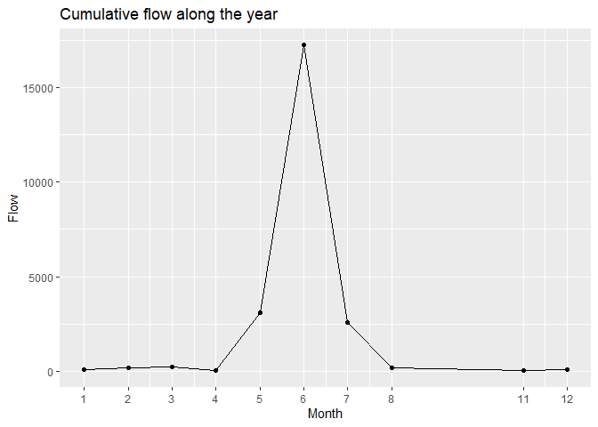
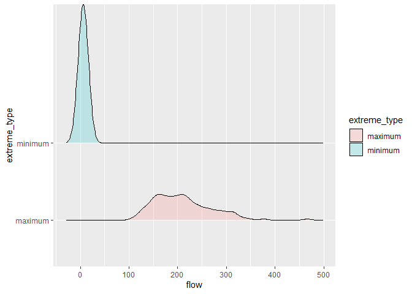
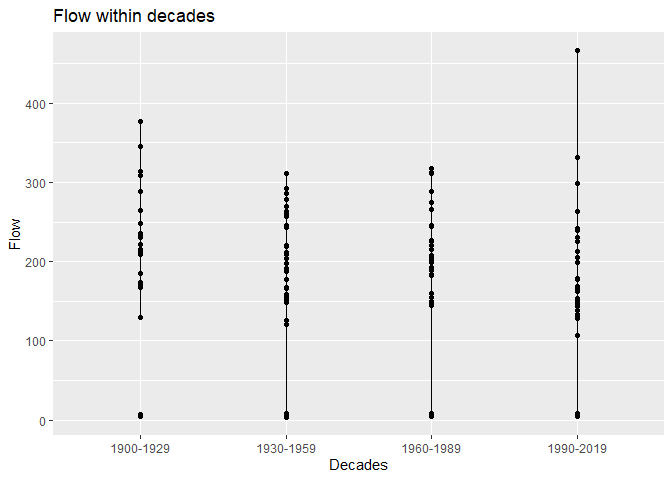

Data-Analysis-Milestone 2
================

``` r
library(datateachr)
library(tidyverse)
```

    ## Warning: package 'tidyverse' was built under R version 4.0.5

    ## -- Attaching packages --------------------------------------- tidyverse 1.3.1 --

    ## v ggplot2 3.3.5     v purrr   0.3.4
    ## v tibble  3.1.4     v dplyr   1.0.7
    ## v tidyr   1.1.3     v stringr 1.4.0
    ## v readr   2.0.1     v forcats 0.5.1

    ## Warning: package 'ggplot2' was built under R version 4.0.5

    ## Warning: package 'tibble' was built under R version 4.0.5

    ## Warning: package 'tidyr' was built under R version 4.0.5

    ## Warning: package 'readr' was built under R version 4.0.5

    ## Warning: package 'purrr' was built under R version 4.0.5

    ## Warning: package 'dplyr' was built under R version 4.0.5

    ## Warning: package 'stringr' was built under R version 4.0.5

    ## Warning: package 'forcats' was built under R version 4.0.5

    ## -- Conflicts ------------------------------------------ tidyverse_conflicts() --
    ## x dplyr::filter() masks stats::filter()
    ## x dplyr::lag()    masks stats::lag()

``` r
library(dplyr)
library(ggridges)
```

    ## Warning: package 'ggridges' was built under R version 4.0.5

``` r
flow_sample <- flow_sample %>% 
  mutate(season = case_when(
    month > 5 & month < 9 ~ "Summer",
    month > 2 & month < 6 ~ "Spring",
    (month > 0 & month < 3) | month == 12  ~ "Winter",
    month > 8 & month < 12 ~ "Autumn",
    TRUE ~ as.character(month)
  ) %>% as.factor()
  )
```

# Task 1

## Research Questions:

Here are the research questions I identified in milestone 1. I have
reworked them slightly to better fit the tasks of this milestone:

1)  What is the relationship between flow and season.

2)  Can we accurately predict flow from month alone?

3)  What effect does extreme\_type have on flow?

4)  What is the relationship between year and flow?

## Task 1.2

### Exploring question 1

First I will compute the statistics for flow for the different seasons.
First `Summer`

``` r
flow_sample %>% filter(season == "Summer") %>% select(flow) %>% summary()
```

    ##       flow      
    ##  Min.   :107.0  
    ##  1st Qu.:167.0  
    ##  Median :209.0  
    ##  Mean   :215.3  
    ##  3rd Qu.:248.0  
    ##  Max.   :466.0

`Spring`

``` r
flow_sample %>% filter(season == "Spring") %>% select(flow) %>% summary()
```

    ##       flow       
    ##  Min.   :  4.14  
    ##  1st Qu.:  6.04  
    ##  Median :  6.77  
    ##  Mean   : 55.46  
    ##  3rd Qu.:133.00  
    ##  Max.   :289.00

`Autumn`

``` r
flow_sample %>% filter(season == "Autumn") %>% select(flow) %>% summary()
```

    ##       flow      
    ##  Min.   :5.210  
    ##  1st Qu.:5.830  
    ##  Median :6.140  
    ##  Mean   :6.106  
    ##  3rd Qu.:6.190  
    ##  Max.   :7.160

`Winter`

``` r
flow_sample %>% filter(season == "Winter") %>% select(flow) %>% summary()
```

    ##       flow     
    ##  Min.   :3.62  
    ##  1st Qu.:5.64  
    ##  Median :6.09  
    ##  Mean   :6.21  
    ##  3rd Qu.:6.73  
    ##  Max.   :8.41

Now I find the mean of flow for the 4 seasons. .

``` r
#mflow = ddply(flow_sample, "season", summarise, grp.mean=mean(flow))
#mflow
```

:( it was working before and then randomly stopped. I really don’t know
why. Sorry.

Finally I create a plot

``` r
#plot1 <- ggplot(flow_sample, aes(x= flow, fill=season, color = season)) + geom_histogram(position="identity", alpha=0.5)
#plot1 +   geom_vline(data=mflow, aes(xintercept=grp.mean, color=season))
```

### Exploring question 2

I compute the range, mean, median, and sd across month

``` r
flow_sample %>%
  group_by(month) %>%
  summarise(mean = mean(flow), 
            r =range(flow), 
            sd = sd(flow), 
            var = var(flow))
```

    ## `summarise()` has grouped output by 'month'. You can override using the `.groups` argument.

    ## # A tibble: 22 x 5
    ## # Groups:   month [11]
    ##    month   mean      r     sd      var
    ##    <dbl>  <dbl>  <dbl>  <dbl>    <dbl>
    ##  1     1   6.50   3.62  1.22     1.48 
    ##  2     1   6.50   8.41  1.22     1.48 
    ##  3     2   6.07   4.08  0.956    0.914
    ##  4     2   6.07   7.98  0.956    0.914
    ##  5     3   6.42   4.14  1.03     1.06 
    ##  6     3   6.42   8.44  1.03     1.06 
    ##  7     4   6.17   4.9   0.833    0.694
    ##  8     4   6.17   7.53  0.833    0.694
    ##  9     5 194.   133    41.8   1750.   
    ## 10     5 194.   289    41.8   1750.   
    ## # ... with 12 more rows

I tried to create boxplots forwhat I thought would be the high and low
flow months.

``` r
flow_sample <- flow_sample %>% 
  mutate(month_Flow = ifelse( month == 4 | month ==5 | month == 6 | month==7| month== 8, "High Flow", "Low Flow"))

flow_sample %>% 
  filter(!is.na(month)) %>% 
  ggplot() +
  aes(x=month, y=flow, fill= month) +
  geom_boxplot() +
  facet_wrap(~month_Flow, scales = "free") +
  labs(
    title = "Boxplot of flow by Season",
    x = "Season",
    y = "Flow"
  ) +
  theme(legend.position = "none") 
```

    ## Warning: Continuous x aesthetic -- did you forget aes(group=...)?

<!-- -->

``` r
flow_sample %>% 
  group_by(month) %>% 
  summarise(cumflow = sum(flow, na.rm = T)) %>% 
  ggplot() +
  aes(x=month, y=cumflow) +
geom_line() +
  geom_point() +
  scale_x_continuous(breaks = unique(flow_sample$month)) +
  labs(
    title = "Cumulative flow along the year",
  
    x = "Month",
    y = "Flow"
  ) 
```

    ## Warning: Removed 1 row(s) containing missing values (geom_path).

    ## Warning: Removed 1 rows containing missing values (geom_point).

<!-- -->

### Exploring question 3

I compute the number of observations for `extreme_type` (categorical)

``` r
flow_sample %>%
  count(extreme_type)
```

    ## # A tibble: 2 x 2
    ##   extreme_type     n
    ##   <chr>        <int>
    ## 1 maximum        109
    ## 2 minimum        109

Now I graph extreme and flow

``` r
flow_sample %>%
  ggplot(aes(x=flow, y=extreme_type)) +  
  geom_density_ridges(alpha=0.2, aes(fill= extreme_type))
```

    ## Picking joint bandwidth of 10.7

    ## Warning: Removed 2 rows containing non-finite values (stat_density_ridges).

<!-- -->

### question 4

I will create a new (ordinal) categorical variable called decades.

``` r
flow_sample <- flow_sample %>% 
  mutate(decades = case_when(
    year > 1900 & year < 1930 ~ "1900-1929",
    year > 1929 & year < 1960 ~ "1930-1959",
    year > 1959 & year < 1990  ~ "1960-1989",
    year > 1989 & year < 2020 ~ "1990-2019",
    TRUE ~ as.character(year)
  ) %>% as.factor()
  )
```

``` r
flow_sample %>% filter(decades == "1900-1929") %>% select(flow) %>% summary()
```

    ##       flow        
    ##  Min.   :  4.560  
    ##  1st Qu.:  6.112  
    ##  Median :148.500  
    ##  Mean   :125.778  
    ##  3rd Qu.:223.250  
    ##  Max.   :377.000  
    ##  NA's   :2

``` r
flow_sample %>% filter(decades == "1930-1959") %>% select(flow) %>% summary()
```

    ##       flow        
    ##  Min.   :  3.620  
    ##  1st Qu.:  6.045  
    ##  Median : 64.705  
    ##  Mean   :108.498  
    ##  3rd Qu.:205.250  
    ##  Max.   :311.000

``` r
flow_sample %>% filter(decades == "1960-1989") %>% select(flow) %>% summary()
```

    ##       flow        
    ##  Min.   :  4.140  
    ##  1st Qu.:  6.135  
    ##  Median : 75.965  
    ##  Mean   :109.452  
    ##  3rd Qu.:200.000  
    ##  Max.   :317.000

``` r
flow_sample %>% filter(decades == "1990-2019") %>% select(flow) %>% summary()
```

    ##       flow        
    ##  Min.   :  4.850  
    ##  1st Qu.:  6.657  
    ##  Median : 57.720  
    ##  Mean   :101.415  
    ##  3rd Qu.:167.250  
    ##  Max.   :466.000

Now I will create a graph of flow and decades

``` r
flow_sample %>% 
  group_by(decades) %>% 
   
  ggplot() +
  aes(x=decades, y=flow) +
  geom_line() +
  geom_point() +
  labs(
    title = "Flow within decades",
    x = "Decades",
    y = "Flow"
  )  
```

    ## Warning: Removed 2 rows containing missing values (geom_point).

<!-- -->

## Task 1.3

I am closer to answering my questions. Directly above I see that there
is a lot of variation in flow within each 29 year period. However each
of the bins seam to have a somewhat similar spread with perhaps a slight
downward trend. The means do apear to be decreasing. There is the
notable exception of the 2013 flood.

There is obviously strong relationships between time of year (`month`
and `season`), `extreme_type` and `flow`, but is one significantly
better for predicting flow?

Is the variation in flow year to year associated with the month in which
flow was collected??

These are the questions I find most interesting.

# Task 2

Here I will tidy the data. Lets take a quick look at `flow_sample`. This
is the before

``` r
head(flow_sample)
```

    ## # A tibble: 6 x 10
    ##   station_id  year extreme_type month   day  flow sym   season month_Flow
    ##   <chr>      <dbl> <chr>        <dbl> <dbl> <dbl> <chr> <fct>  <chr>     
    ## 1 05BB001     1909 maximum          7     7   314 <NA>  Summer High Flow 
    ## 2 05BB001     1910 maximum          6    12   230 <NA>  Summer High Flow 
    ## 3 05BB001     1911 maximum          6    14   264 <NA>  Summer High Flow 
    ## 4 05BB001     1912 maximum          8    25   174 <NA>  Summer High Flow 
    ## 5 05BB001     1913 maximum          6    11   232 <NA>  Summer High Flow 
    ## 6 05BB001     1914 maximum          6    18   214 <NA>  Summer High Flow 
    ## # ... with 1 more variable: decades <fct>

Given the definition I believe this data set is tidy. Each column is a
variable `year`, `extreme_type` `month` `day`, `flow`, `sym` `season`
and `decades`. Each row is an observation (one for each year). All of
the cells contain the value for that variable on a given year.

## Task 2.1

Now I play with some functions from tidyverse.

I will unite the year, month, and day to make date.

``` r
(flow_sample1 <- flow_sample %>%
    unite(col = "date", c(year, month, day), sep = "-"))
```

    ## # A tibble: 218 x 8
    ##    station_id date      extreme_type  flow sym   season month_Flow decades  
    ##    <chr>      <chr>     <chr>        <dbl> <chr> <fct>  <chr>      <fct>    
    ##  1 05BB001    1909-7-7  maximum        314 <NA>  Summer High Flow  1900-1929
    ##  2 05BB001    1910-6-12 maximum        230 <NA>  Summer High Flow  1900-1929
    ##  3 05BB001    1911-6-14 maximum        264 <NA>  Summer High Flow  1900-1929
    ##  4 05BB001    1912-8-25 maximum        174 <NA>  Summer High Flow  1900-1929
    ##  5 05BB001    1913-6-11 maximum        232 <NA>  Summer High Flow  1900-1929
    ##  6 05BB001    1914-6-18 maximum        214 <NA>  Summer High Flow  1900-1929
    ##  7 05BB001    1915-6-27 maximum        236 <NA>  Summer High Flow  1900-1929
    ##  8 05BB001    1916-6-20 maximum        309 <NA>  Summer High Flow  1900-1929
    ##  9 05BB001    1917-6-17 maximum        174 <NA>  Summer High Flow  1900-1929
    ## 10 05BB001    1918-6-15 maximum        345 <NA>  Summer High Flow  1900-1929
    ## # ... with 208 more rows

``` r
print(flow_sample1)
```

    ## # A tibble: 218 x 8
    ##    station_id date      extreme_type  flow sym   season month_Flow decades  
    ##    <chr>      <chr>     <chr>        <dbl> <chr> <fct>  <chr>      <fct>    
    ##  1 05BB001    1909-7-7  maximum        314 <NA>  Summer High Flow  1900-1929
    ##  2 05BB001    1910-6-12 maximum        230 <NA>  Summer High Flow  1900-1929
    ##  3 05BB001    1911-6-14 maximum        264 <NA>  Summer High Flow  1900-1929
    ##  4 05BB001    1912-8-25 maximum        174 <NA>  Summer High Flow  1900-1929
    ##  5 05BB001    1913-6-11 maximum        232 <NA>  Summer High Flow  1900-1929
    ##  6 05BB001    1914-6-18 maximum        214 <NA>  Summer High Flow  1900-1929
    ##  7 05BB001    1915-6-27 maximum        236 <NA>  Summer High Flow  1900-1929
    ##  8 05BB001    1916-6-20 maximum        309 <NA>  Summer High Flow  1900-1929
    ##  9 05BB001    1917-6-17 maximum        174 <NA>  Summer High Flow  1900-1929
    ## 10 05BB001    1918-6-15 maximum        345 <NA>  Summer High Flow  1900-1929
    ## # ... with 208 more rows

Now I separate them again.

``` r
(flow_sample1.1 <- flow_sample1 %>%
    separate(date, into = c( "year", "month", "day"), sep = "-"))
```

    ## # A tibble: 218 x 10
    ##    station_id year  month day   extreme_type  flow sym   season month_Flow
    ##    <chr>      <chr> <chr> <chr> <chr>        <dbl> <chr> <fct>  <chr>     
    ##  1 05BB001    1909  7     7     maximum        314 <NA>  Summer High Flow 
    ##  2 05BB001    1910  6     12    maximum        230 <NA>  Summer High Flow 
    ##  3 05BB001    1911  6     14    maximum        264 <NA>  Summer High Flow 
    ##  4 05BB001    1912  8     25    maximum        174 <NA>  Summer High Flow 
    ##  5 05BB001    1913  6     11    maximum        232 <NA>  Summer High Flow 
    ##  6 05BB001    1914  6     18    maximum        214 <NA>  Summer High Flow 
    ##  7 05BB001    1915  6     27    maximum        236 <NA>  Summer High Flow 
    ##  8 05BB001    1916  6     20    maximum        309 <NA>  Summer High Flow 
    ##  9 05BB001    1917  6     17    maximum        174 <NA>  Summer High Flow 
    ## 10 05BB001    1918  6     15    maximum        345 <NA>  Summer High Flow 
    ## # ... with 208 more rows, and 1 more variable: decades <fct>

``` r
print(flow_sample1.1)
```

    ## # A tibble: 218 x 10
    ##    station_id year  month day   extreme_type  flow sym   season month_Flow
    ##    <chr>      <chr> <chr> <chr> <chr>        <dbl> <chr> <fct>  <chr>     
    ##  1 05BB001    1909  7     7     maximum        314 <NA>  Summer High Flow 
    ##  2 05BB001    1910  6     12    maximum        230 <NA>  Summer High Flow 
    ##  3 05BB001    1911  6     14    maximum        264 <NA>  Summer High Flow 
    ##  4 05BB001    1912  8     25    maximum        174 <NA>  Summer High Flow 
    ##  5 05BB001    1913  6     11    maximum        232 <NA>  Summer High Flow 
    ##  6 05BB001    1914  6     18    maximum        214 <NA>  Summer High Flow 
    ##  7 05BB001    1915  6     27    maximum        236 <NA>  Summer High Flow 
    ##  8 05BB001    1916  6     20    maximum        309 <NA>  Summer High Flow 
    ##  9 05BB001    1917  6     17    maximum        174 <NA>  Summer High Flow 
    ## 10 05BB001    1918  6     15    maximum        345 <NA>  Summer High Flow 
    ## # ... with 208 more rows, and 1 more variable: decades <fct>

I am now doing to untidy the data by widening the data so we see the
flow of each `extreme_type` by making `extreme_type` it’s own column.

``` r
(flow_sample2 <- flow_sample %>%
  pivot_wider(id_cols = c(-extreme_type, -flow),
              names_from = extreme_type,
              values_from = flow))
```

    ## # A tibble: 218 x 10
    ##    station_id  year month   day sym   season month_Flow decades  maximum minimum
    ##    <chr>      <dbl> <dbl> <dbl> <chr> <fct>  <chr>      <fct>      <dbl>   <dbl>
    ##  1 05BB001     1909     7     7 <NA>  Summer High Flow  1900-19~     314      NA
    ##  2 05BB001     1910     6    12 <NA>  Summer High Flow  1900-19~     230      NA
    ##  3 05BB001     1911     6    14 <NA>  Summer High Flow  1900-19~     264      NA
    ##  4 05BB001     1912     8    25 <NA>  Summer High Flow  1900-19~     174      NA
    ##  5 05BB001     1913     6    11 <NA>  Summer High Flow  1900-19~     232      NA
    ##  6 05BB001     1914     6    18 <NA>  Summer High Flow  1900-19~     214      NA
    ##  7 05BB001     1915     6    27 <NA>  Summer High Flow  1900-19~     236      NA
    ##  8 05BB001     1916     6    20 <NA>  Summer High Flow  1900-19~     309      NA
    ##  9 05BB001     1917     6    17 <NA>  Summer High Flow  1900-19~     174      NA
    ## 10 05BB001     1918     6    15 <NA>  Summer High Flow  1900-19~     345      NA
    ## # ... with 208 more rows

``` r
arrange_all(flow_sample2)
```

    ## # A tibble: 218 x 10
    ##    station_id  year month   day sym   season month_Flow decades  maximum minimum
    ##    <chr>      <dbl> <dbl> <dbl> <chr> <fct>  <chr>      <fct>      <dbl>   <dbl>
    ##  1 05BB001     1909     7     7 <NA>  Summer High Flow  1900-19~     314   NA   
    ##  2 05BB001     1909    NA    NA <NA>  <NA>   <NA>       1900-19~      NA   NA   
    ##  3 05BB001     1910     6    12 <NA>  Summer High Flow  1900-19~     230   NA   
    ##  4 05BB001     1910    NA    NA <NA>  <NA>   <NA>       1900-19~      NA   NA   
    ##  5 05BB001     1911     2    27 <NA>  Winter Low Flow   1900-19~      NA    5.75
    ##  6 05BB001     1911     6    14 <NA>  Summer High Flow  1900-19~     264   NA   
    ##  7 05BB001     1912     3    14 <NA>  Spring Low Flow   1900-19~      NA    5.8 
    ##  8 05BB001     1912     8    25 <NA>  Summer High Flow  1900-19~     174   NA   
    ##  9 05BB001     1913     3    18 B     Spring Low Flow   1900-19~      NA    6.12
    ## 10 05BB001     1913     6    11 <NA>  Summer High Flow  1900-19~     232   NA   
    ## # ... with 208 more rows

It is clear that there are many missing values. First I am going to
check how many for maximum and how many for minimum.

``` r
sum(is.na(flow_sample2$maximum))
```

    ## [1] 109

``` r
sum(is.na(flow_sample2$minimum))
```

    ## [1] 111

Most of these missing values are not an issue as only data on one
extreme type was collected per year. I want to see the rows where both
are NA.

``` r
sum(is.na(flow_sample2$maximum) & is.na(flow_sample2$minimum) )
```

    ## [1] 2

There are only 2 rows that have missing values for both extreme types.
Since these rows have no flow information I am going to remove them.

``` r
which(is.na(flow_sample2$maximum) & is.na(flow_sample2$minimum) )
```

    ## [1] 110 111

These are the two rows I will remove.

``` r
flow_sample2.1 <- flow_sample2[-c(110,111),]
arrange_all(flow_sample2.1)
```

    ## # A tibble: 216 x 10
    ##    station_id  year month   day sym   season month_Flow decades  maximum minimum
    ##    <chr>      <dbl> <dbl> <dbl> <chr> <fct>  <chr>      <fct>      <dbl>   <dbl>
    ##  1 05BB001     1909     7     7 <NA>  Summer High Flow  1900-19~     314   NA   
    ##  2 05BB001     1910     6    12 <NA>  Summer High Flow  1900-19~     230   NA   
    ##  3 05BB001     1911     2    27 <NA>  Winter Low Flow   1900-19~      NA    5.75
    ##  4 05BB001     1911     6    14 <NA>  Summer High Flow  1900-19~     264   NA   
    ##  5 05BB001     1912     3    14 <NA>  Spring Low Flow   1900-19~      NA    5.8 
    ##  6 05BB001     1912     8    25 <NA>  Summer High Flow  1900-19~     174   NA   
    ##  7 05BB001     1913     3    18 B     Spring Low Flow   1900-19~      NA    6.12
    ##  8 05BB001     1913     6    11 <NA>  Summer High Flow  1900-19~     232   NA   
    ##  9 05BB001     1914     6    18 <NA>  Summer High Flow  1900-19~     214   NA   
    ## 10 05BB001     1914    11    17 <NA>  Autumn Low Flow   1900-19~      NA    7.16
    ## # ... with 206 more rows

Now I will put it back.

``` r
flow_sample2.2 <- flow_sample2 %>% 
  pivot_longer(cols = c(maximum, minimum ), 
               names_to  = "extreme_type", 
               values_to = "flow")
arrange_all(flow_sample2.2)
```

    ## # A tibble: 436 x 10
    ##    station_id  year month   day sym   season month_Flow decades   extreme_type
    ##    <chr>      <dbl> <dbl> <dbl> <chr> <fct>  <chr>      <fct>     <chr>       
    ##  1 05BB001     1909     7     7 <NA>  Summer High Flow  1900-1929 maximum     
    ##  2 05BB001     1909     7     7 <NA>  Summer High Flow  1900-1929 minimum     
    ##  3 05BB001     1909    NA    NA <NA>  <NA>   <NA>       1900-1929 maximum     
    ##  4 05BB001     1909    NA    NA <NA>  <NA>   <NA>       1900-1929 minimum     
    ##  5 05BB001     1910     6    12 <NA>  Summer High Flow  1900-1929 maximum     
    ##  6 05BB001     1910     6    12 <NA>  Summer High Flow  1900-1929 minimum     
    ##  7 05BB001     1910    NA    NA <NA>  <NA>   <NA>       1900-1929 maximum     
    ##  8 05BB001     1910    NA    NA <NA>  <NA>   <NA>       1900-1929 minimum     
    ##  9 05BB001     1911     2    27 <NA>  Winter Low Flow   1900-1929 maximum     
    ## 10 05BB001     1911     2    27 <NA>  Winter Low Flow   1900-1929 minimum     
    ## # ... with 426 more rows, and 1 more variable: flow <dbl>

You can see that we once again have variable `extreme_type` with values
minimum and maximum.

## Task 2.3

``` r
flow_sampleTR <-flow_sample[-c(110,111),] %>%
  filter(extreme_type == "maximum") %>%
select(-c(station_id, sym)) %>%
  select(year, season, flow, month, day, extreme_type)


arrange_all(flow_sampleTR)
```

    ## # A tibble: 109 x 6
    ##     year season  flow month   day extreme_type
    ##    <dbl> <fct>  <dbl> <dbl> <dbl> <chr>       
    ##  1  1909 Summer   314     7     7 maximum     
    ##  2  1910 Summer   230     6    12 maximum     
    ##  3  1911 Summer   264     6    14 maximum     
    ##  4  1912 Summer   174     8    25 maximum     
    ##  5  1913 Summer   232     6    11 maximum     
    ##  6  1914 Summer   214     6    18 maximum     
    ##  7  1915 Summer   236     6    27 maximum     
    ##  8  1916 Summer   309     6    20 maximum     
    ##  9  1917 Summer   174     6    17 maximum     
    ## 10  1918 Summer   345     6    15 maximum     
    ## # ... with 99 more rows

This is the data I will carry forwards. I have removed the two row with
no flow recorded. As well I removed `station_id` as there is only one
station, and `sym` as there are more missing than present values. I
filter for the extreme type `maximum` as there is much more variation
and I think it may be more interesting to explore. Finally I rearrange
the order of the columns.
